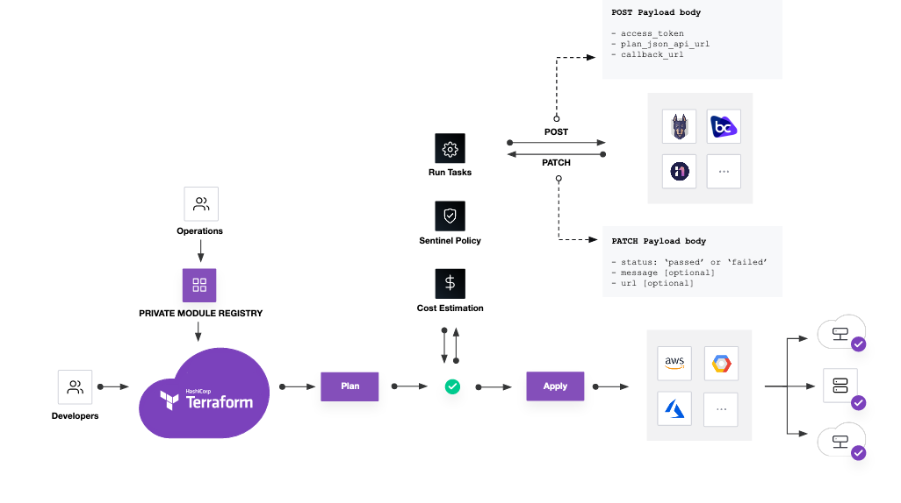

# run-task-poc

Creates a custom Terraform Run Task which executes a AWS Lambda.  

## Run Task Workflow

### Request Handler

The TFC run task logic will send a `POST` request to an endpoint when a run task is triggered. In this Proof of Concept I have a request handler lambda that receives the request, validates the payload, then forwards the request on to a callback handler.  

TFC expects the run task handler to return a `200 OK` to confirm that the run task is being executed. Any further updates that the run task wants to report are sent to TFC via `PATCH` calls.

### Callback Handler

This lambda performs the custom run task checks. Status updates and / or final results can be sent to TFC via `PATCH` requests. The URL and API token for the `PATCH` are supplied to the run task in the request payload.  

### Configuring the run task

The run task is configured against a TFC Organization or an individual workspace. I use terraform (in [tfe.tf](./tfe.tf)) in this Poc, and this is highly recommended.

## HMAC Validation

To add a layer of security to the run task and detect any tampering or interception of the request payload, I am providing a HMAC Key in my run task.  TFC will calculate a sha512 sum of the request payload using the HMAC key and provide it to the run task in the `X-Tfc-Task-Signature` HTTP header.

I configure my request handler lambda with the same key and use the python [hmac](https://docs.python.org/3/library/hmac.html) library to verify the signature.

## Custom validation

In my PoC run task I pull the terraform plan from TFC. The URL for this comes in the request payload. I don't use the plan here - it's just to show what is possible. Instead, my run task uses the terraform files themselves.  

For every remote terraform run (plan or apply), files are uploaded to TFC as a [configuration version](https://developer.hashicorp.com/terraform/cloud-docs/workspaces/configurations). This is stored as a binary blob and contains all the terraform files present when the run was started.

These can be downloaded as a `.tar.gz` archive via the [configuration versions API](https://developer.hashicorp.com/terraform/cloud-docs/api-docs/configuration-versions#configuration-versions-api).

My custom run task simply executes a `terraform fmt` against the run's terraform files. [The command](https://developer.hashicorp.com/terraform/cli/commands/fmt) will return a non-zero error code if the files aren't formatted correctly, which I then feed back to TFC as the result of my run task via a `PATCH` HTTP call.

I don't pass anything more complicated as the result of my run task other than a status (`passed` or `failed`) and a short message (the output of `terraform fmt` if it failed). It is possible to pass a URL for more details: a possible future enhancement for my PoC. I could create a S3 bucket, stuff the details in there, then pass the  bucket's URL to TFC.

## Further reading

* [Run Tasks Integration](https://developer.hashicorp.com/terraform/cloud-docs/integrations/run-tasks) on the HashiCorp site explains how to build a custom run task. It's where I got most of my info.
* [Run Tasks Integration](https://developer.hashicorp.com/terraform/cloud-docs/api-docs/run-tasks/run-tasks-integration) also on the HashiCorp site details the API for a custom run task - json payload, HTTP status codes.
* AWS have produced a [IAM Access Analyzer](https://github.com/aws-ia/terraform-aws-runtask-iam-access-analyzer) custom run task that also uses AWS Lambdas but is much more industrialised than my simple PoC (it uses things like Step Functions, Secrets Manager, WAF integration). My PoC is useful for anyone wanting to know the workings of a custom run task, but this repository provides a way, way better production offering.
* This [HashiTalks YouTube video](https://www.youtube.com/watch?v=1eSiIxVE9Vw) goes with the above AWS repo.
* Not forgetting, of course, the excellent AWS docs on [Building Lambda functions with Python](https://docs.aws.amazon.com/lambda/latest/dg/lambda-python.html)
